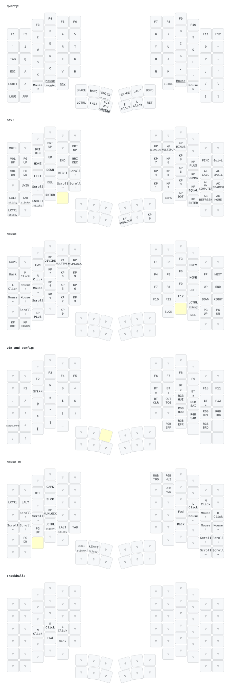

# ZMK Configuration Template
Wireless Cyboard keyboard configuration repository template for using ZMK firmware. [Instructions for use are located on our documentation site](https://docs.cyboard.digital/user-manual/quick-start/configure-layout).

> **Already have a copy of this template from before July 2026?** The board and
> layout definitions were reorganized in July 2026, and older copies track the
> moving `main` branch — so a rebuild can silently break your keymap (most often
> a dead thumb cluster). Follow [Updating a config repo created before July
> 2026](#updating-a-config-repo-created-before-july-2026) to move onto the pinned
> stable stack; after that, [Pinned versions](#pinned-versions) keeps it from
> happening again.

## Keymap diagram



The **Draw Keymap** GitHub Action (`.github/workflows/draw.yml`) redraws this
diagram with [keymap-drawer](https://github.com/caksoylar/keymap-drawer)
whenever anything in `config/` changes, and commits the result to
`keymap-drawer/` (`imprint.svg` plus the parsed `imprint.yaml`). Legends and
styling are set in `keymap_drawer.config.yaml`. The key positions come from the
physical layout chosen in `config/imprint.keymap`, read from the pinned
`zmk-keyboards` module. You can also run it by hand from the Actions tab.

## Pinned versions
`config/west.yml` pins two projects to fixed releases so your firmware is reproducible and cannot change under you:

- **`zmk`** → the latest **stable** ZMK release (currently `v0.3.0`), matching the firmware stack behind [studio.cyboard.digital](https://studio.cyboard.digital).
- **`zmk-keyboards`** → a tagged release (currently `v2026.07`) of the Cyboard board, shield, and physical-layout definitions. Pinning this is what keeps your keymap working: the physical layouts — key positions, layout names, and the order bindings appear in — are frozen at that tag, so a later change on `zmk-keyboards` `main` cannot shift them under your keymap and silently break keys (e.g. a dead thumb cluster after a rebuild).

Version bumps are deliberate: when you want newer boards, layouts, or a newer stable ZMK, edit `config/west.yml` (and, for a new ZMK, the matching tag in `.github/workflows/build.yml`), push, and let CI prove the build before you flash. The [zmk-keyboards releases](https://github.com/Cyboard-DigitalTailor/zmk-keyboards/releases) page lists what each tag contains.

To track current ZMK `main` (Zephyr 4.1) instead, edit `config/west.yml`: set the `zmk` revision to `main` and the `zmk-keyboards` revision to `zephyr-4.1`.

## ZMK Studio support

The left-half firmware built from this template has [ZMK Studio](https://studio.cyboard.digital) enabled (see the `imprint_left` entry in `build.yaml`), so you can edit your keymap live over USB without reflashing. To unlock the keyboard for Studio, **hold the A- and F-position keys (left home row) for 3 seconds**. The unlock combo is tied to the physical key locations, so it keeps working no matter how you remap your keymap.

Keymap changes made in Studio are stored in the keyboard's flash, separately from the `.keymap` file in this repo: they survive reflashes of firmware built from this repo, and the `.keymap` file only provides the defaults Studio starts from (or falls back to after a settings reset).

This repo also builds a `settings_reset` artifact in GitHub Actions. Flash that UF2 once to clear stored settings (including Studio-saved keymap data), then flash your normal left/right firmware again.

## Per-layer RGB underglow

Stock ZMK (v0.3.0) has a single global underglow color, so this repo adds a
small module (`src/layer_rgb.c`, wired up by `CMakeLists.txt`, `Kconfig`,
`dts/bindings/` and `zephyr/module.yml`) that changes the underglow whenever
the active layer changes. The colors live in
[`config/layer_rgb.dtsi`](config/layer_rgb.dtsi):

```dts
qwerty { layer = <0>; color-hsb = <170 100 60>; effect = <0>; };
mouse  { layer = <2>; color-hsb = <120 100 80>; effect = <1>; speed = <3>; };
```

- The **highest active layer that has an entry** sets the color. A layer with
  no entry falls through to the next lower one.
- `effect`: 0 solid, 1 breathe, 2 spectrum, 3 swirl (optional). `speed`: 1-5 (optional).
- The left half tracks layers and sends each change to the right half through
  the regular `&rgb_ug` behavior, so **only the left half needs reflashing**
  after you change colors.
- `&rgb_ug RGB_TOG` still turns the lights on and off. Hue and brightness
  keys still work, but the next layer change overrides them.
- ZMK saves the underglow state to flash about 60 s after the last change,
  as it does for the `&rgb_ug` keys.

### Emulator

Open [`rgb-emulator/index.html`](rgb-emulator/index.html) in a browser (just
double-click it, no server needed). It draws this keymap's layout and legends
and simulates the firmware's effects with the Imprint's brightness limits.
Hold or toggle layers to preview them, adjust each layer's color, effect and
speed, then copy or download the generated `layer_rgb.dtsi` into `config/`.
The key legends are baked into the page, so if you change `imprint.keymap`
they won't update. The colors and export still work.

## Selecting your keyboard model

The keymap selects your keyboard variant with a chosen **physical layout** node, e.g.:

```dts
chosen { zmk,physical-layout = &physical_layout_imprint_number_row; };
```

The available Imprint layouts are defined in
[`zmk-keyboards`](https://github.com/Cyboard-DigitalTailor/zmk-keyboards/blob/main/boards/shields/imprint/imprint-layouts.dtsi);
the `config/default keymaps/` folders contain a matching keymap for each. The
Dactyl and legacy single-arc keymaps still use the older
`zmk,matrix-transform` chosen node, as those models predate the physical
layout definitions.

## Updating a config repo created before July 2026

Older configs track ZMK `main` and select the keyboard model with a
`zmk,matrix-transform` chosen node. To move one onto the current stable stack:

1. In `config/west.yml`, set the `zmk` revision from `main` to `v0.3.0`, and
   the `zmk-keyboards` revision from `main` to the current release tag
   (`v2026.07`). Pinning `zmk-keyboards` to a tag rather than the moving `main`
   branch is what stops a future definitions change from silently breaking your
   keymap again — see [Pinned versions](#pinned-versions) above.
2. In `.github/workflows/build.yml`, change `@main` to `@v0.3.0`.
3. In your `config/imprint.keymap`, replace the chosen node

   ```dts
   chosen { zmk,matrix-transform = &imprint_<your model>; };
   ```

   with

   ```dts
   chosen { zmk,physical-layout = &physical_layout_imprint_<your model>; };
   ```

   Step 3 matters: with a chosen `zmk,matrix-transform`, ZMK ignores the
   physical layouts that the current `zmk-keyboards` shields are built
   around, and the firmware is not compatible with ZMK Studio.

   Pick the physical layout that matches the keys your board **physically
   has** (its rows, and whether it has a full bottom row). This is not always
   the same name as your old `matrix-transform`: some older configs selected a
   larger *superset* transform and left the unpopulated positions as `&trans`.
   For example, a board with three letter rows and no bottom row is
   `letters_only_no_bottom_row`, even if its old config named
   `function_row_full_bottom_row`. When unsure, flash and open
   [ZMK Studio](https://studio.cyboard.digital) — it renders the layout you
   selected, so you can see at a glance whether it matches your keyboard.
4. Re-lay-out your keymap to match the selected layout. **The physical
   layouts do not use the same key order as the old matrix transforms** — in
   particular the 12 thumb-cluster keys are the **last 12 bindings** of every
   current two-arc Imprint layout (two arcs of three per hand), after all the
   grid rows. The easiest way to get this right is to start from the matching
   keymap in `config/default keymaps/imprint_<your layout>/imprint.keymap` (the
   default-keymap directories are `imprint_`-prefixed) and drop your key choices
   into its slots. Each `bindings` block must have exactly as many
   entries as the layout has keys, or keys silently stop responding.

   > **Thumb keys stopped working after migrating?** That is the classic
   > symptom of a keymap whose bindings no longer line up with the selected
   > layout: the grid keys still work (they share positions across layouts) but
   > the thumb bindings land on the wrong — or nonexistent — positions, so the
   > thumb cluster goes dead. Rebuild the layer from the matching default
   > keymap so your thumb bindings occupy the last twelve slots. On a
   > single-arc board only one of the two thumb rows physically exists; use
   > ZMK Studio to confirm which, then bind those keys.
5. (Optional, for ZMK Studio) In `build.yaml`, add the Studio snippet and
   config to the `imprint_left` entry, as in this template's `build.yaml`:

   ```yaml
   - board: assimilator-bt
     shield: imprint_left
     snippet: studio-rpc-usb-uart
     cmake-args: -DCONFIG_ZMK_STUDIO=y
   ```